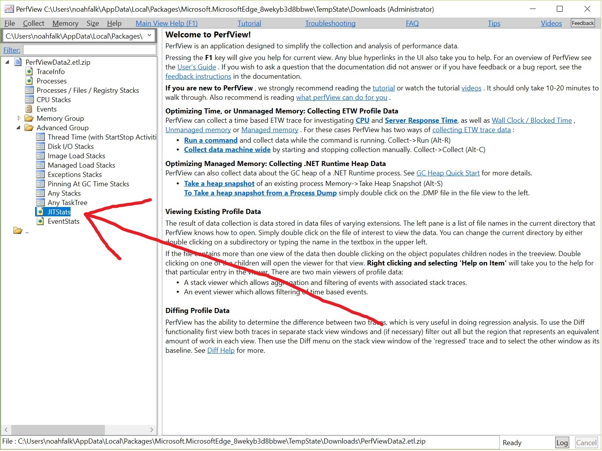
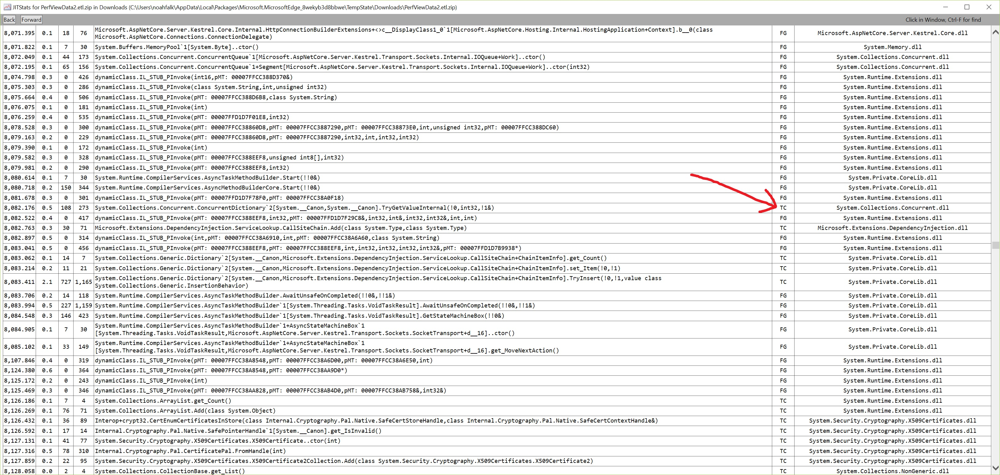

# Tiered Compilation Testing Demo

In .Net Core 2.1 RC we added a new preview feature called Tiered Compilation that helps improve startup times and steady state performance. This page shows how to test out
 the feature quickly, either on your own applications or on a sample ASP.NET MusicStore application.

# Part 1 - Running an experiment

## 1.1: Download the .Net Core 2.1 RC

Pick an installer from https://www.microsoft.com/net/download/dotnet-core/sdk-2.1.300-rc1 that matches your OS. I am using Windows x64 here.

## 1.2: Get source for the application you want to test

I'll be using the MusicStore test app but you can use any .Net Core app that runs on 2.1 RC. At a command prompt that has git:

    F:\github>git clone https://github.com/aspnet/JitBench
    F:\github>cd JitBench
    F:\github\JitBench>git checkout tiered_compilation_demo

## 1.3: Confirm you are using the right version of the .Net Core SDK

    F:\github\JitBench>dotnet --version
    2.1.300-rc1-008673

If you see a different version you may have installed a post-RC build or your app has a global.json targetting a different version of the SDK.
You can explicitly direct dotnet to use the RC version of the SDK by creating global.json in the current directory with this text:

    {
        "sdk":
        {
            "version": "2.1.300-rc1-008673"
        }
    }

## 1.4: Build and publish the application

    F:\github\JitBench>cd src\MusicStore
    F:\github\JitBench\src\MusicStore>dotnet publish -c Release

## 1.5: Run the app without tiered compilation enabled

    F:\github\JitBench\src\MusicStore>cd bin\Release\netcoreapp2.1\publish\
    F:\github\JitBench\src\MusicStore\bin\Release\netcoreapp2.1\publish> dotnet MusicStore.dll

Test app output. This output is specific to the MusicStore test app, your apps invariably have different output:

    ============= Startup Performance ============

    Server start (ms):   974
    1st Request (ms):    674
    Total (ms):         1648

    ========== Steady State Performance ==========

      Requests    Aggregate Time(ms)    Req/s   Req Min(ms)   Req Mean(ms)   Req Median(ms)   Req Max(ms)   SEM(%)
    -----------   ------------------   ------   -----------   ------------   --------------   -----------   ------
        2-  100                 1976   301.45          2.36           3.32             3.06         12.01     3.18
      101-  250                 2442   321.92          2.37           3.11             2.96          7.35     1.63
      251-  500                 3162   347.12          2.12           2.88             2.77         11.02     1.45
      501-  750                 3874   351.00          2.05           2.85             2.79          5.18     0.82
      751- 1000                 4644   324.80          2.31           3.08             2.95          7.55     1.25
     1001- 1500                 6170   327.67          2.12           3.05             2.90         18.02     1.46
     1501- 2000                 7603   348.84          2.06           2.87             2.78          5.24     0.79
     2001- 3000                10550   339.38          2.12           2.95             2.83         19.77     0.77

## 1.6: Run the app with tiered compilation enabled

Tiered compilation can be turned on and off with an environment variable 'COMPlus_TieredCompilation'. If the value is
not set or 0 then the feature is off, if the value is 1 the feature is on. 

    F:\github\JitBench\src\MusicStore>set COMPlus_TieredCompilation=1
    F:\github\JitBench\src\MusicStore\bin\Release\netcoreapp2.1\publish> dotnet MusicStore.dll

    ============= Startup Performance ============

    Server start (ms):   871
    1st Request (ms):    565
    Total (ms):         1436

    ========== Steady State Performance ==========

      Requests    Aggregate Time(ms)    Req/s   Req Min(ms)   Req Mean(ms)   Req Median(ms)   Req Max(ms)   SEM(%)
    -----------   ------------------   ------   -----------   ------------   --------------   -----------   ------
        2-  100                 1896   214.81          2.81           4.66             3.89         21.91     5.83
      101-  250                 2411   291.28          2.80           3.43             3.36          5.71     1.11
      251-  500                 3107   359.22          1.84           2.78             2.70         12.71     1.76
      501-  750                 3607   500.26          1.21           2.00             1.87          4.30     1.52
      751- 1000                 4142   467.07          1.44           2.14             2.06          4.28     1.35
     1001- 1500                 5168   487.32          1.41           2.05             1.94          9.97     1.15
     1501- 2000                 6143   512.93          1.31           1.95             1.84          4.13     1.00
     2001- 3000                 8160   495.75          1.22           2.02             1.89          7.72     0.86

## 1.7 Comparing performance

The MusicStore test application uses System.Diagnostics.StopWatch and console output to quickly log some numbers for startup or steady-state performance, but ultimately you will have to decide what performance metrics are most important to your application. I won't attempt to repeat the wealth of general benchmarking and statistical analysis advice available around the web and thankfully these larger timescale benchmarks are usually forgiving, but a few common issues to look out for:

- Run your test application several times before paying any heed to the measurements. The first few runs will likely warm up various caches and the performance differences these caches cause will confound your results. Alternatively
you can measure the very first launch of the application after booting the machine with nothing cached but now you need to power the cycle the machine and follow the exact same startup sequence between each measurement to
keep it consistent.
- Measure the same thing many times, then average.
- Try to minimize the number of other applications, services, and network activity running on the machine. If you must have activity as part of the test environment try to keep it constant throughout the test period.
- After you have measured, sanity check the measurement distribution and make sure averages aren't being unduly influenced by a few outliers or unexpectedly multi-modal measurements.

# Part 2 - Exploring the application behavior

## Is tiered compilation working?

If your benchmarks change dramatically like the example above it is easy to see that tiered compilation is working, but if there is no change you might wonder whether tiered compilation benefits your scenario
or there was a mistake turning it on. One easy way to check is by using [PerfView](https://github.com/Microsoft/perfview/blob/master/documentation/Downloading.md). Make sure to get at least PerfView version 
2.0.15 that has support for visualizing tiered compilation information. You want to [collect a machine-wide trace](https://channel9.msdn.com/Series/PerfView-Tutorial/PerfView-Tutorial-11-Data-Collection-for-Server-Scenarios)
that includes the execution of your test app as shown in step 1.6 above. By default the collector uses a circular buffer with a 500MB capacity and the demo app generates a lot of events which may exceed that.
Using PerfView's GUI I increased the limit to 1000MB to avoid losing any data. Once collection is complete open the JitStats view within the Advanced Group in the tree view control:

In the JitStats view there are several indications that confirm tiered compilation was operating:

Known issues:

- PerfView analysis will only detect tiered compilation is in use when background compilations occur in the trace. In very short running applications its possible that tiered compilation
is enabled but not enough code is run to trigger any method to perform a background recompile. In this case PerfView will incorrectly report tiered compilation is disabled because there is no evidence of it in the trace.

- It is possible for PerfView to lose data in the circular buffer even if the UI does not show that it filled up. Usually this can be easily spotted because most of the jit events will be missing, and the problem can be avoided by making the buffer larger or not tracing as long. If all the trace events for tiered compilation are lost then PerfView will incorrectly indicate the feature was disabled.

Both of these issues should be improved in the future.

## Exploring JIT behavior

Using the same PerfView trace collected above, there is an 'Individual JIT Events' section of the JitStats report which shows every time the JIT was invoked, which method it was compiling, and what triggered the compilation. By looking
for methods with the 'TC' (Tiered Compilation) trigger you can determine all methods which were ever recompiled:

## Is tiered compilation living up to its potential?

If the trace shows tiered compilation is running but the performance hasn't improved you might wonder if tiered compilation isn't running as well as it should be. Although a full analysis would require some non-trivial analysis of the .NET runtime, there are
some simple tests anyone can run to determine the overhead tiered compilation adds relative to having the JIT generate code as fast as possible or having the JIT generate its best code.

### Startup

Set the environment variable COMPlus\_JitMinOpts=1 to make the JIT create code as quickly as possible* and then run your application again, comparing its startup performance against startup with tiered compilation enabled.
Ideally tiered compilation should give startup performance equal or just slighly worse than this COMPlus\_JitMinOpts configuration which accounts for some extra bookkeeping overhead that tiered compilation must do. If tiered
 compilation is significantly slower than COMPlus\_JitMinOpts something may be amiss and I'd love to hear about it. On the other hand if tiered compilation is significantly faster it probably means your startup test is spending
a lot of time running code rather than jit compiling it. You should try to pick a leaner definition of startup that will execute less code.

*If we are being technical JitMinOpts tells the JIT not to optimize which isn't always the same thing as creating code as fast as possible. Some optimizations actually make compilation faster too! However for the current
JIT implementation COMPlus\_JitMinOpts=1 is a very good approximation of generating jitted code as quickly possible.

### Steady-state

To test steady-state performance now set COMPlus\_ReadyToRun=0. This disables using code that is precompiled within (most) framework images and instead forces the JIT to create code for all of the methods. The code created by
the JIT at runtime is more optimized than what can be statically compiled in the images. This results in a very slow startup because so much JIT compilation is occuring, but once complete the steady-state performance should
be high. Compare this steady-state performance to steady-state performance of tiered compilation. Ideally tiered compilation should give performance equal or slightly worse than the COMPlus\_ReadyToRun=0 performance. If tiered
compilation is substantially worse I'd love to hear about it, and if it is substantially better there is probably something fishy with the measurement.

# Run into trouble?

I hope your experiments run smoothly, but if not or you have questions please let me know. File an issue in this repo or at github.com/dotnet/coreclr and mention me, @noahfalk.

